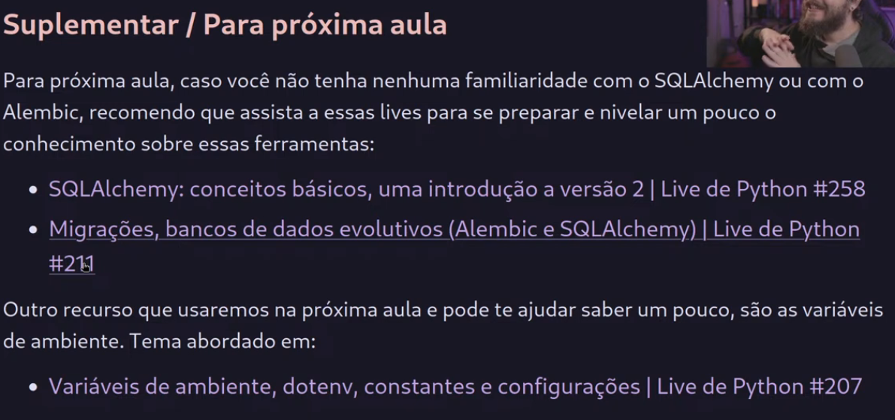

# Curso de FastAPI 2025

## Aula 01 | Configuração do ambiente e hello world com testes
### https://www.youtube.com/watch?v=f6bkf67lXLo

## Aula 02 | Fundamentos do desenvolvimento web
### https://www.youtube.com/watch?v=JFJErxis_ZM

## Aula 03 | Criando Rotas CRUD 2025
### https://www.youtube.com/watch?v=bi6kzV21ucs

## Antes da Aula 04

## SQLAlchemy
### https://www.youtube.com/watch?v=t4C1c62Z4Ag

## Alembic e SQLAlchemy
### https://www.youtube.com/watch?v=yQtqkq9UkDA
| Tempo do último acesso: 01:21:00

### https://www.youtube.com/watch?v=DiiKff1z2Yw

## Aula 04 | Banco de Dados com SQLAlchemy e Gerenciando Migrações com Alembic
### https://www.youtube.com/watch?v=I7IrmN7jMqE

| Tempo do último acesso: 00:00:00
